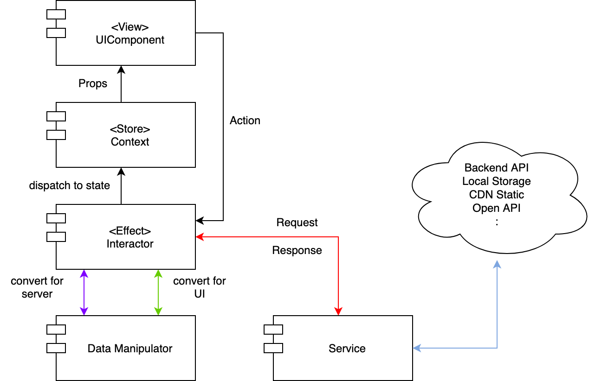

# 프론트엔드 아키텍처 개발 가이드

현재 웹프론트엔드 업무의 기반이 되는 아키텍처는 `Flux Architecture` 가 대세 입니다.

다만, React 에서 즐겨 쓰는 `Redux` 는 그 특성상 Boiler Plate 작성이 많아져 번거로움이 있는 관계로

부득이하게 동료분들과 협의하여 `Context API` 기반의 아키텍처로 구성하게 되었습니다.

따라서 상태 관리는 특별한 사유가 없다면 Context 기반으로 작성하게 됩니다.

이러한 Context 기반으로 Flux 를 모방한 프론트엔드 아키텍처를 본 문서 한정, 통칭 `아키텍처`라 명명하니 이 후 참고 바랍니다.

이하 편의상 평어체로 서술 합니다.

# 다이어그램



# 폴더 구조

프로젝트 내 폴더 구조는 `by Feature` 규칙을 따른다.

[내용 보기](feature-folder.md)

# 작성 순서

TypeScript 기반으로 작업하는 특성상, 관련 타입을 먼저 작성하는 것을 권장한다.

1. 모델 작성
2. 서비스 작성
3. 상태 관리자 작성
4. 컴포넌트 작성
5. 컨테이너 및 페이지 작성

참고로 각 순서는 각 업무별 계층(Layer)을 의미한다.

이는 Clean Architecture 의 구성을 닮아 있으며 권장하는 작성 순서는 Domain Driven Development (DDD) 개발 방법론을 일부 채용한다 볼 수 있다. (100%는 아님..)

## 파일명 규칙

상기 언급된 작성 순서에 따른 파일명 규칙은 다음과 같다.

```
{feature[subFeature]}.{subType}.ts
```

아래는 Feature 가 `article` 일 때의 예시이다.

| type       | subType    | folder       | filename examples     |
| :--------- | :--------- | :----------- | :-------------------- |
| Model      | Server     | /models      | article.server.ts     |
| Model      | UI         | /models      | article.ui.ts         |
| Service    | Data       | /services    | article.data.ts       |
| Service    | Calc       | /services    | article.calc.ts       |
| Service    | Proc       | /services    | article.proc.ts       |
| Service    | Convert    | /services    | article.convert.ts    |
| Service    | Extract    | /services    | article.extract.ts    |
| Service    | Create     | /services    | article.create.ts     |
| Service    | Merge      | /services    | article.merge.ts      |
| Service    | Parse      | /services    | article.parse.ts      |
| Context    | Context    | /contexts    | article.context.ts    |
| Interactor | Interactor | /interactors | article.interactor.ts |

유틸리티는 `/util` 내에 포함되며 예외적으로 아래와 같은 패턴을 따른다.

```
util.{type}.ts
```

type 은 다음 표를 참고 한다.

| type       | desc                                       | filename examples  |
| :--------- | :----------------------------------------- | :----------------- |
| array      | 배열 관련                                  | util.array.ts      |
| component  | 컴포넌트 관련                              | util.component.ts  |
| validate   | 유효성 검증 관련                           | util.validate.ts   |
| collection | 배열 외 자료구조 관련                      | util.collection.ts |
| string     | 문자열 관련                                | util.string.ts     |
| format     | 서식(포맷) 관련                            | util.format.ts     |
| etc        | 그 외 어느 카테고리에도 포함되지 않는 것들 | util.etc.ts        |

기 작성된 유틸리티가 다른 곳에서도 쓰인다면, common module 로 옮겨서 공용화 할 수 있다.

# 상세 가이드

내용이 많은 관계로 각각 내용을 별도 문서로 작성, 링크해 둔다.

1. [모델 작성](guide-001-model.md)
2. [서비스 작성](guide-002-service.md)
3. [컨텍스트 작성](guide-003-context.md)
4. [컴포넌트 작성(Atomic Design)](atomic-design.md)
5. [추가 코딩 규칙](../ss-conventions/README.md)
